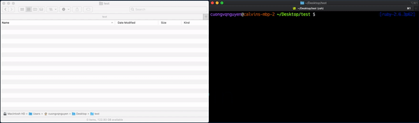

<h2 align="center">Trivin made everything simple, fast, and clean</h2>
<h3 align="center">The most well-structured open-source template to build a powerful and clean apps</h3>

<p align="center">
  <a href="https://github.com/calvinqc/trivin/pulls">
    
  </a>
  <a href="https://www.javascript.com/">
    
  </a>
  <a href="">
    
  </a>
  <a href="https://github.com/calvinqc/trivin/stargazers">
    
  </a>

  <a href="https://www.npmjs.com/package/trivin">
    
  </a>
</p>

<!-- <p align="center">
    
  </a>
</p> -->

**[Trivin](https://calvinqc.github.io/trivin/)** is a free and open-source project that bootstrap everything you need to deploy your full-stack application. It consists of clean and quality code, which is suggested by industry engineers.

# Getting Started

## Installation

Install trivin with this one-line command

```sh
npm i trivin -g
```

## Requirements

- NodeJS >= 10.x
- NPM >= 6.x

# Quick Overview

```sh
$ trivin myapp -g -i

? Please choose which project template to use
❯ mern
  node-passport-jwt
  react
  simple-node-server

  ✔ Copy Project files
  ✔ Initialize git
  ✔ Install all dependencies. This could take around 1~2 minutes.

Initialized M.E.R.N project with MongoDB Atlas/Google App Engine setup
DONE Project ready
```

# Feature

- Choose a template. Default template: MERN

```
$ trivin <app-name> <app-template>
```

- `-g`: git init for your project
- `-i`: Install all dependencies for both React and Node folders
- ESLint Airbnb Config + Prettier
- Securely Authenticate/Authorize APIs with Passport-JWT
- Works on macOS, Windows, and Linux.

## Project

- Include Redux Dev Tools Config (You need to install this extension on your browser)

- **React** project is well-structured with Redux-thunk/React-router/Axios

- Authenticate/authorize with Passport-jwt

- Database: MongoDB is hosted on MongoDB Atlas

- Mailing API for multiple purposes using Nodemailer and Google OAuth Client

# Become a Trivin Contributor

1. Fork the repo

2. Create a folder with your **Template-name** and add all files to that folder

3. Add your template name to **[Choices](https://github.com/calvinqc/trivin/blob/dee197123419e267193d90b9795a72f9ae909a27/src/)**.

   - **IMPORTANT: The name should be the same**

4. Practicing pushing to your branch and create a PR with Github CLI

   - Check out how to use new Github CLI [here.](https://medium.com/better-programming/say-hello-to-the-new-github-clis-7e2612fb3918)

5. Trivin team will review your code, and approve/request changes.

# Upcoming Feature

- Testing

- README for each template

- Deployment: Choices to deploy app with Google App Engine/Heroku

# Help/Supports

- Join Trivin's Slack Channel and ask any questions [here](trivin.slack.com)

- If something doesn’t work, please [file an issue here](https://github.com/calvinqc/trivin/issues).

# Learning

### Node Setup with Passport-jwt Authorization

- Medium **[Instruction](https://medium.com/swlh/perfect-structure-to-authenticate-authorize-api-with-node-js-and-passport-jwt-d529b1a618ba)**. Code found **[here](https://github.com/calvinqc/trivin/tree/master/templates/node-passport-jwt)**

### React + Redux-thunk + Router Setup

- Medium **[Instruction](https://medium.com/@calvinqc/i-built-a-m-e-r-n-codebase-in-an-hour-742acd71ed7e).** Code found **[here](https://github.com/calvinqc/trivin/tree/master/templates/mern/client)**

### Very Simple Node.js setup

- Medium **[Instruction](https://medium.com/swlh/a-complete-guide-build-a-scalable-3-tier-architecture-with-mern-stack-es6-ca129d7df805)**. Code found **[here](https://github.com/calvinqc/trivin/tree/master/templates/simple-node-server)**

### Multi-purpose API

- Medium **[Instruction](https://medium.com/@calvinqc/multi-purposes-mailing-api-using-nodemailer-gmail-google-oauth-28de49118d77)**

# License

This project is open-sourced software licensed under the ISC License. See the LICENSE file for more information.
