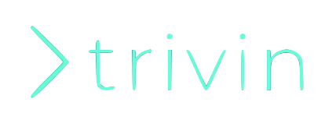

<p align="center">
  <a href="https://strapi.io">
    
  </a>
</p>
<h3 align="center">Trivin made everything simple, fast, and clean</h3>
<p align="center">The most well-structured open-source template to build a powerful and clean apps</p>
<br />
<p align="center">
  <!-- <a href="https://www.npmjs.org/package/strapi">
    
  </a>
  <a href="https://www.npmjs.org/package/strapi">
    
  </a> -->
  <!-- <a href="http://trivin.slack.com">
     -->
  </a>
</p>

**[Trivin](https://calvinqc.github.io/MERN-template/)** is a free and open-source project that bootstrap everything you need to deploy your full-stack application. It consists of clean and quality code, which is suggested by industry engineers.

- ESLint Airbnb Config + Prettier
- Securely Authenticate/Authorize APIs with Passport-JWT
- Works on macOS, Windows, and Linux.

# Getting Started

## Installation

Install quick-mern with this one-line command

```sh
npm i trivin -g
```

## Requirements

- NodeJS >= 10.x
- NPM >= 6.x

# Quick Overview

```sh
$ trivin myapp -g -i

? Please choose which project template to use
❯ mern
  node-passport-jwt
  react

  ✔ Copy Project files
  ✔ Initialize git
  ✔ Install all dependencies. This could take around 1~2 minutes.

Initialized M.E.R.N project with MongoDB Atlas/Google App Engine setup
DONE Project ready
```

# Feature

- Choose a template. `$ trivin <app-name> <app-template>`
- `-g`: git init for your project
- `-i`: Install all dependencies for both React and Node folders

## Client

- Include Redux Dev Tools Config (You need to install this extension on your browser)
- React project is well-structured with Redux-thunk/React-router/Axios

## Server

- Register/login/ other APIs are authenticate/authorize with Passport-jwt
- Deployment: Choices to deploy app with Google App Engine/Heroku
- Database: MongoDB is hosted on MongoDB Atlas
- Mailing API for multiple purposes using Nodemailer and Google OAuth Client

# Help/Supports

Join Trivin's Slack Channel and ask any questions [here](trivin.slack.com)

# Become a Trivin Contributor

- If something doesn’t work, please [file an issue here](https://github.com/calvinqc/MERN-template/issues).

- Looking to contribute a great template to this open source. Pull requests are always welcome.

- Check out new Github CLI [Here.](https://medium.com/better-programming/say-hello-to-the-new-github-clis-7e2612fb3918)

# Upcoming Feature

- Testing
- Deployment/ Hosting

# Learning

## Node Setup with Passport-jwt Authorization

- Medium **[Instruction](https://medium.com/swlh/perfect-structure-to-authenticate-authorize-api-with-node-js-and-passport-jwt-d529b1a618ba)**

- Code found **[here](https://github.com/calvinqc/MERN-template/tree/master/server)**

## React + Redux-thunk + Router Setup

- Medium [Instruction](https://medium.com/@calvinqc/i-built-a-m-e-r-n-codebase-in-an-hour-742acd71ed7e)

- Code found **[here](https://github.com/calvinqc/MERN-template/tree/master/client)**

## Node-simple-template Setup without Passport-jwt

- Medium **[Instruction](https://medium.com/swlh/a-complete-guide-build-a-scalable-3-tier-architecture-with-mern-stack-es6-ca129d7df805)**

- Code found **[here](https://github.com/calvinqc/Nodejs-Server-Template)**

## Multi-purpose API

- Medium **[Instruction](https://medium.com/@calvinqc/multi-purposes-mailing-api-using-nodemailer-gmail-google-oauth-28de49118d77)**

# License

This project is open-sourced software licensed under the MIT License. See the LICENSE file for more information.
